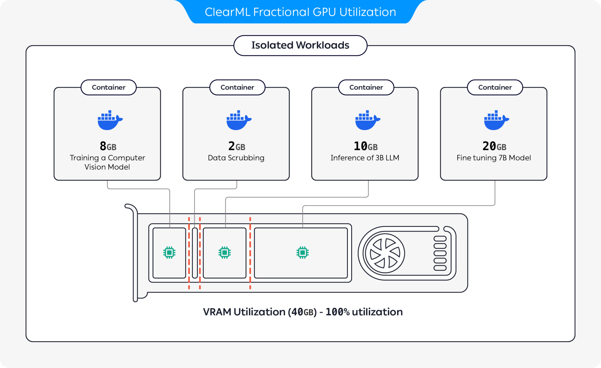

<div align="center">

# 🚀 🔥 Fractional GPU! ⚡ 📣
## Run multiple containers on the same GPU with driver level memory limitation ✨ and compute time-slicing 🎊 

`🌟 Leave a star to support the project! 🌟`

</div>

## 🔰 Introduction

Sharing high-end GPUs or even prosumer & consumer GPUs between multiple users is the most cost-effective way to accelerate AI development. Unfortunately, until now the only existing solution was static MIG/slicing high-end GPUs and required Kubernetes. <br>

🔥 🎉 We’re introducing ClearML’s Dynamic Fractional GPU! 🎉 🔥 <br>

ClearML offers a comprehensive suite of tools to help AI builders accelerate their AI development and increase utilization by using fractions of GPUs and running multiple workloads on the same silicon.

## 🚀 Offerings 

* Pre-packaged containers with CUDA 11.x, 12.x and 13.x support, featuring built-in GPU memory limits. Multiple containers can run on the same GPU, preventing any single user from consuming the full GPU memory.
* Support for both NVIDIA and AMD GPUs
* On-the-fly dynamic GPU slicing - ClearML’s [**Kubernetes operator**](https://clear.ml/docs/latest/docs/clearml_agent/fractional_gpus/cdmo) (and bare-metal agent) dynamically adjusts the MIG profile according to workload demands, without requiring manual re-partitioning. [Requires Enterprise License]
* Driver-level container memory limits and compute-time slicing - With ClearML’s enterprise dynamic fractional-GPU, you can run any off-the-shelf container while ClearML enforces GPU VRAM limits ensuring one container does not interfere or is exposed to other containers on the same GPU. [Requires Enterprise License]
* Unified Memory Technology support - Park model weights and caches in CPU memory, transferring them to GPU memory on demand when an API call is made. This allows multiple models to be deployed on single- or multi-GPU machines, keeping all models online and ready with near-zero switching latency. [Requires Enterprise License]
* Quota, priority, and spillover rules for GPU fractions - With ClearML’s Resource Manager you can define hierarchical quotas and spill-over behaviour so teams or jobs don’t battle each other for GPU access. [Requires Enterprise License]

With these capabilities, ClearML enables running AI workloads with optimized hardware utilization and workload performance. This repository covers container-based fractional GPUs. For more information on ClearML's fractional GPU offerings, see 
the [ClearML documentation](https://clear.ml/docs/latest/docs/clearml_agent/clearml_agent_fractional_gpus). 



## ⚡ Installation

Pick the container that works for you and launch it:
```bash
docker run -it --gpus 0 --ipc=host --pid=host clearml/fractional-gpu:u22-cu12.3-8gb bash
```

To verify fraction GPU memory limit is working correctly, run inside the container:
```bash
nvidia-smi
``` 
Here is an example output from A100 GPU:

```
+---------------------------------------------------------------------------------------+
| NVIDIA-SMI 545.23.08              Driver Version: 545.23.08    CUDA Version: 12.3     |
|-----------------------------------------+----------------------+----------------------+
| GPU  Name                 Persistence-M | Bus-Id        Disp.A | Volatile Uncorr. ECC |
| Fan  Temp   Perf          Pwr:Usage/Cap |         Memory-Usage | GPU-Util  Compute M. |
|                                         |                      |               MIG M. |
|=========================================+======================+======================|
|   0  A100-PCIE-40GB                Off  | 00000000:01:00.0 Off |                  N/A |
| 32%   33C    P0              66W / 250W |      0MiB /  8128MiB |      3%      Default |
|                                         |                      |             Disabled |
+-----------------------------------------+----------------------+----------------------+
                                                                                         
+---------------------------------------------------------------------------------------+
| Processes:                                                                            |
|  GPU   GI   CI        PID   Type   Process name                            GPU Memory |
|        ID   ID                                                             Usage      |
|=======================================================================================|
+---------------------------------------------------------------------------------------+
```

### 🐳 Containers

| Memory Limit  | CUDA Ver | Ubuntu Ver | Docker Image                             |
|:-------------:|:--------:|:----------:|:----------------------------------------:|
|     12 GiB    |   12.3   |   22.04    | `clearml/fractional-gpu:u22-cu12.3-12gb` |
|     12 GiB    |   12.3   |   20.04    | `clearml/fractional-gpu:u20-cu12.3-12gb` |
|     12 GiB    |   11.7   |   22.04    | `clearml/fractional-gpu:u22-cu11.7-12gb` |
|     12 GiB    |   11.1   |   20.04    | `clearml/fractional-gpu:u20-cu11.1-12gb` |
|     8 GiB     |   12.3   |   22.04    | `clearml/fractional-gpu:u22-cu12.3-8gb`  |
|     8 GiB     |   12.3   |   20.04    | `clearml/fractional-gpu:u20-cu12.3-8gb`  |
|     8 GiB     |   11.7   |   22.04    | `clearml/fractional-gpu:u22-cu11.7-8gb`  |
|     8 GiB     |   11.1   |   20.04    | `clearml/fractional-gpu:u20-cu11.1-8gb`  |
|     4 GiB     |   12.3   |   22.04    | `clearml/fractional-gpu:u22-cu12.3-4gb`  |
|     4 GiB     |   12.3   |   20.04    | `clearml/fractional-gpu:u20-cu12.3-4gb`  |
|     4 GiB     |   11.7   |   22.04    | `clearml/fractional-gpu:u22-cu11.7-4gb`  |
|     4 GiB     |   11.1   |   20.04    | `clearml/fractional-gpu:u20-cu11.1-4gb`  |
|     2 GiB     |   12.3   |   22.04    | `clearml/fractional-gpu:u22-cu12.3-2gb`  |
|     2 GiB     |   12.3   |   20.04    | `clearml/fractional-gpu:u20-cu12.3-2gb`  |
|     2 GiB     |   11.7   |   22.04    | `clearml/fractional-gpu:u22-cu11.7-2gb`  |
|     2 GiB     |   11.1   |   20.04    | `clearml/fractional-gpu:u20-cu11.1-2gb`  |

  
> [!IMPORTANT]
>
> You must execute the container with `--pid=host` !

> [!NOTE]
>
> **`--pid=host`** is required to allow the driver to differentiate between the container's 
processes and other host processes when limiting memory / utilization usage

> [!TIP]
>
> **[ClearML-Agent](https://clear.ml/docs/latest/docs/clearml_agent/) users add `[--pid=host]` to your `agent.extra_docker_arguments` section in your [config file](https://github.com/allegroai/clearml-agent/blob/c9fc092f4eea9c3890d582aa2a098c3c2f39ce72/docs/clearml.conf#L190)**


## 🔩 Customization

Build your own containers and inherit form the original containers.

You can find a few examples [here](https://github.com/allegroai/clearml-fractional-gpu/tree/main/examples).

## ☸ Kubernetes

Fractional GPU containers can be used on bare-metal executions as well as Kubernetes PODs.
Yes! By using one of the Fractional GPU containers you can limit the memory consumption of your Job/Pod and 
easily share GPUs without fearing they will memory crash one another!

Here's a simple Kubernetes POD template:
```yaml
apiVersion: v1
kind: Pod
metadata:
  name: train-pod
  labels:
    app: trainme
spec:
  hostPID: true
  containers:
  - name: train-container
    image: clearml/fractional-gpu:u22-cu12.3-8gb
    command: ['python3', '-c', 'print(f"Free GPU Memory: (free, global) {torch.cuda.mem_get_info()}")']
```

> [!IMPORTANT]
>
> You must execute the pod with `hostPID: true` !

> [!NOTE]
>
> **`hostPID: true`** is required to allow the driver to differentiate between the pod's 
processes and other host processes when limiting memory / utilization usage


## 🔌 Support & Limitations

The containers support Nvidia drivers <= `545.x.x`.
We will keep updating & supporting new drivers as they continue to be released

**Supported GPUs**: RTX series 10, 20, 30, 40, A series, and Data-Center P100, A100, A10/A40, L40/s, H100 

**Limitations**: Windows Host machines are currently not supported. If this is important for you, leave a request in the [Issues](/issues) section

## ❓ FAQ

- **Q**: Will running `nvidia-smi` inside the container report the local processes GPU consumption? <br>
**A**: Yes,  `nvidia-smi` is communicating directly with the low-level drivers and reports both accurate container GPU memory as well as the container local memory limitation.<br>
Notice GPU utilization will be the global (i.e. host side) GPU utilization and not the specific local container GPU utilization.

- **Q**: How do I make sure my Python / Pytorch / Tensorflow are actually memory limited? <br>
**A**: For PyTorch you can run: <br>
```python
import torch
print(f'Free GPU Memory: (free, global) {torch.cuda.mem_get_info()}')
```
Numba example:
```python
from numba import cuda
print(f'Free GPU Memory: {cuda.current_context().get_memory_info()}')
```

- **Q**: Can the limitation be broken by a user? <br>
**A**: We are sure a malicious user will find a way. It was never our intention to protect against malicious users. <br>
If you have a malicious user with access to your machines, fractional GPUs are not your number 1 problem 😃

- **Q**: How can I programmatically detect the memory limitation? <br>
**A**: You can check the OS environment variable `GPU_MEM_LIMIT_GB`. <br>
Notice that changing it will not remove or reduce the limitation.

- **Q**: Is running the container **with** `--pid=host` secure / safe? <br>
**A**: It should be both secure and safe. The main caveat from a security perspective is that
a container process can see any command line running on the host system.
If a process command line contains a "secret" then yes, this might become a potential data leak.
Notice that passing "secrets" in the command line is ill-advised, and hence we do not consider it a security risk.
That said if security is key, the enterprise edition (see below) eliminate the need to run with `pid-host` and thus fully secure.

- **Q**: Can you run the container **without** `--pid=host` ? <br>
**A**: You can! But you will have to use the enterprise version of the clearml-fractional-gpu container 
(otherwise the memory limit is applied system wide instead of container wide). If this feature is important for you, please contact [ClearML sales & support](https://clear.ml/contact-us).


## 📄 License

The license to use ClearML is granted for research or development purposes only. ClearML may be used for educational, personal, or internal commercial use.

An expanded Commercial license for use within a product or service is available as part of the [ClearML](https://clear.ml) Scale or Enterprise solution.

## 🤖 Commercial & Enterprise version

ClearML offers enterprise and commercial license adding many additional features on top of fractional GPUs,
these include orchestration, priority queues, quota management, compute cluster dashboard, 
dataset management & experiment management, as well as enterprise grade security and support.
Learn more about [ClearML Orchestration](https://clear.ml) or talk to us directly at [ClearML sales](https://clear.ml/contact-us).

## 📡 How can I help?

Tell everyone about it! #ClearMLFractionalGPU

Join our [Slack Channel](https://joinslack.clear.ml/)

Tell us when things are not working, and help us debug it on the [Issues Page](https://github.com/allegroai/clearml-fractional-gpu/issues)

## 🌟 Credits

This product is brought to you by the ClearML team with ❤️

